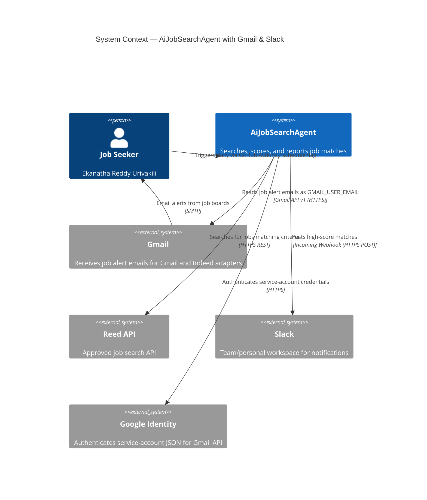
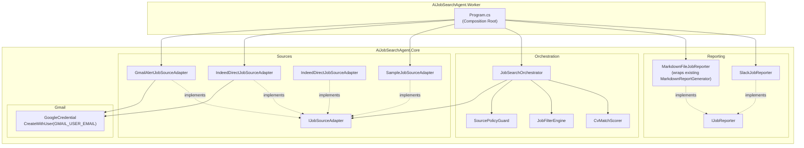
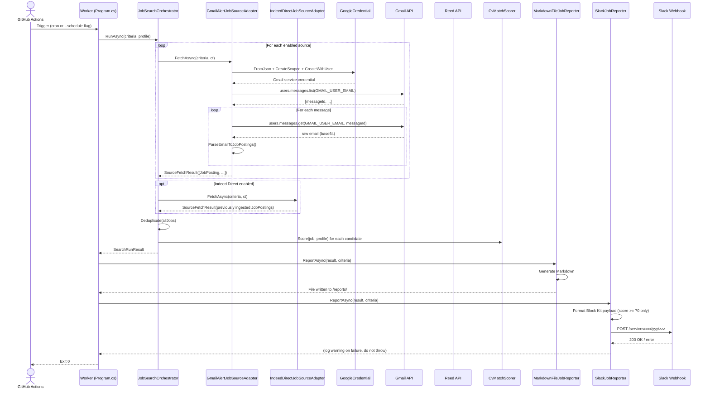
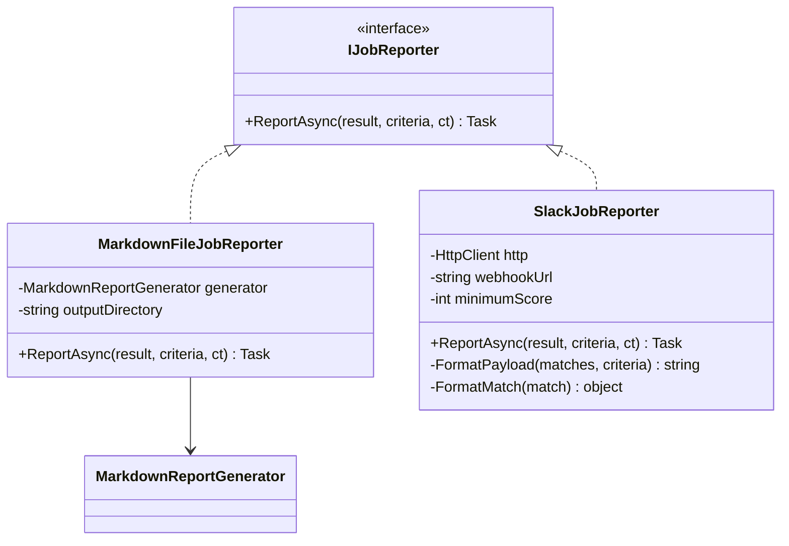
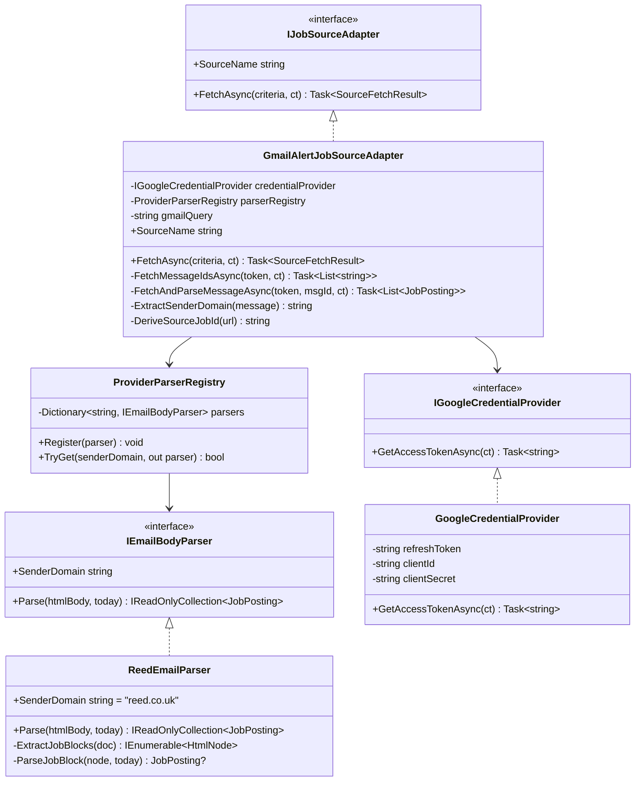
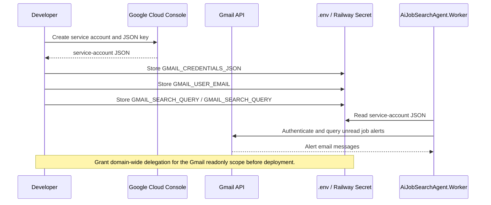
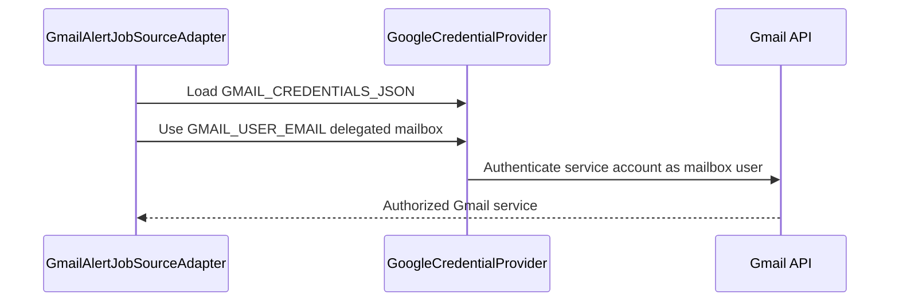
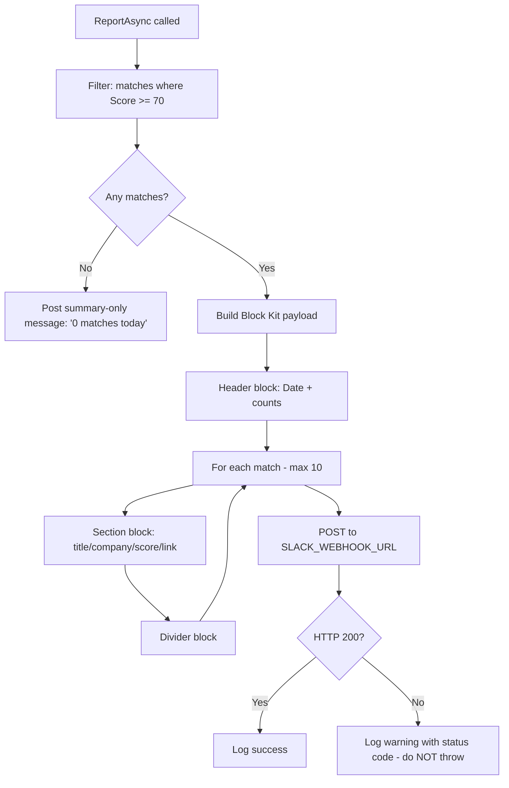
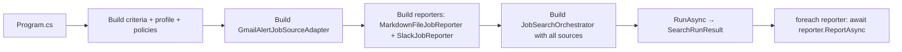
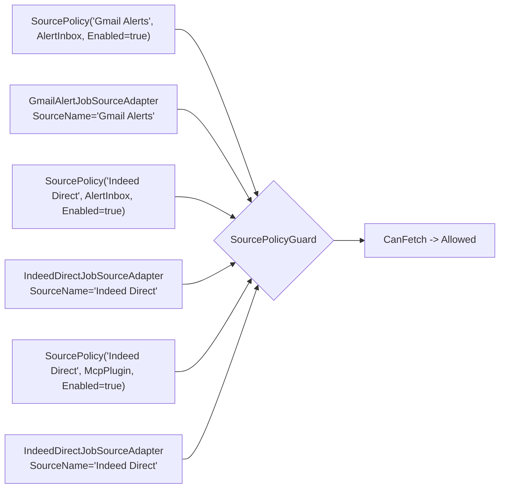

# Gmail & Slack Integration — Architecture Design

**Status:** Historical design review; implementation now uses Google service-account JSON and Slack incoming webhooks.
**Date:** 2026-06-02  
**Author:** Principal Engineering Review

---

## Current Implementation Note

The live code uses `GMAIL_CREDENTIALS_JSON` with `GoogleCredential.FromJson(...)`, not the OAuth refresh-token variables proposed in the original review below. Use this document for design context, but use `README.md` and `.env.example` as the source of truth for current setup.

Current variables:

| Variable | Required | Notes |
|---|---:|---|
| `GMAIL_CREDENTIALS_JSON` | Yes, if Gmail alert ingestion is enabled | Service-account JSON, pasted as one value. |
| `GMAIL_USER_EMAIL` | Yes, if Gmail alert ingestion is enabled | Delegated mailbox that receives job alerts. |
| `GMAIL_SEARCH_QUERY` | No | Default Gmail alert search. |
| `SLACK_WEBHOOK_URL` | No | Posts high-score matches when configured. |
| `SETTINGS_ENCRYPTION_KEY` | Yes, if saving secrets from Settings UI | 32-byte base64 key generated with `openssl rand -base64 32`. |

## 1. Architectural Opinion on the Submitted Plan

The submitted plan is directionally correct. The `IJobSourceAdapter` reuse for Gmail and the `IJobReporter` abstraction are both sound. Before building, four structural decisions need to be made explicit:

### 1.1 Decisions to Lock In Before Coding

| # | Decision | Recommendation | Risk if Deferred |
|---|----------|----------------|-----------------|
| D-1 | Gmail auth strategy | Implemented with `GMAIL_CREDENTIALS_JSON` service-account JSON plus `GMAIL_USER_EMAIL` delegated mailbox. Workspace domain-wide delegation is required for service-account mailbox access. | Wrong auth strategy means complete rewrite of credential handling |
| D-2 | Reporter invocation point | Reporters should be called from the **Worker** (`Program.cs`), not injected into `JobSearchOrchestrator`. Orchestrator's responsibility stops at `SearchRunResult`. | Violates single responsibility; Orchestrator becomes aware of I/O concerns |
| D-3 | Per-provider email parser | Implement a `Dictionary<string, IEmailBodyParser>` keyed on sender domain. One parser per provider. **Not** a single monolithic parser. | Adding a second provider (Indeed, LinkedIn) requires touching existing parsing code |
| D-4 | Cross-source deduplication | Gmail-parsed jobs need a deterministic `SourceJobId` derived from the job URL (e.g. `SHA256(url)[0..8]`). Otherwise the existing `Deduplicate()` in `JobSearchOrchestrator` won't catch overlap with API-sourced jobs from the same provider. | Duplicate jobs appear in output; user gets confused |

### 1.2 What the Plan Gets Right

- `IJobReporter` is the correct abstraction. Multiple reporters (Markdown, Slack) run sequentially after the search.
- `FetchMode.AlertInbox` is already present in `Domain.cs` and `Defaults.cs` — the policy guard is already wired for this flow.
- Slack via incoming webhooks (not the Bot API) is right for a worker process. No OAuth, just a POST.
- Deterministic regex/HTML parsing is the right call over LLM-based extraction — faster, free, and the email structure from providers is stable enough.

### 1.3 What Needs Strengthening

- The plan lacks a **token storage strategy** for Gmail OAuth. This is the most operationally complex part.
- The plan lacks **error isolation**: a Slack webhook failure or Gmail auth failure must not fail the entire search run.
- The plan merges all three classes (`IJobReporter`, `MarkdownFileJobReporter`, `SlackJobReporter`) into a single `Reporting.cs`. This works but should be noted as a deliberate choice given the project's flat-file structure.

---

## 2. High-Level Design (HLD)

### 2.1 System Context



### 2.2 Component Architecture



### 2.3 End-to-End Data Flow



---

## 3. Low-Level Design (LLD)

### 3.1 Interface & Contract Definitions

#### 3.1.1 `IJobReporter`

```csharp
// src/AiJobSearchAgent.Core/Reporting.cs

public interface IJobReporter
{
    // Must not throw. Log and return on failure.
    Task ReportAsync(
        SearchRunResult result,
        JobSearchCriteria criteria,
        CancellationToken cancellationToken);
}
```

**Design note:** Reporters are fire-and-forget from the Worker's perspective. A Slack POST failure must not abort the run or surface as an exception to the caller. Each implementation logs its own errors.

#### 3.1.2 `IEmailBodyParser`

```csharp
// src/AiJobSearchAgent.Core/Gmail.cs (new file)

public interface IEmailBodyParser
{
    // The sender domain this parser handles, e.g. "reed.co.uk"
    string SenderDomain { get; }

    IReadOnlyCollection<JobPosting> Parse(string htmlBody, DateOnly today);
}
```

#### 3.1.3 `IGoogleCredentialProvider`

```csharp
// src/AiJobSearchAgent.Core/Gmail.cs

public interface IGoogleCredentialProvider
{
    Task<string> GetAccessTokenAsync(CancellationToken cancellationToken);
}
```

---

### 3.2 Class Design

#### 3.2.1 Reporting Layer



#### 3.2.2 Gmail Source Layer



---

### 3.3 Gmail Authentication Flow

The worker runs unattended. The implemented adapter reads `GMAIL_CREDENTIALS_JSON`, delegates to `GMAIL_USER_EMAIL`, and creates Google credentials from the configured service-account JSON.



**Runtime service-account authentication (per-run):**



---

### 3.4 Email Parsing — Reed Alert Format

Reed job alert emails follow a predictable structure. The parser targets the stable HTML block pattern.

```mermaid
flowchart TD
    A[Raw email body - base64] --> B[Decode UTF-8]
    B --> C{Content-Type?}
    C -->|text/html| D[Load into HtmlAgilityPack]
    C -->|multipart| E[Extract text/html part]
    E --> D
    D --> F[Select all job card divs\nXPath: //div\[contains @class 'job'\]]
    F --> G{Any nodes found?}
    G -->|No| H[Return empty + warning]
    G -->|Yes| I[For each node]
    I --> J[Extract: title, company, location, salary, url]
    J --> K{URL present?}
    K -->|No| L[Skip node]
    K -->|Yes| M[DeriveSourceJobId = SHA256 of URL first 8 chars]
    M --> N[Construct JobPosting\nSource=Reed, FetchMode=AlertInbox]
    N --> O[Add to result list]
    O --> I
```

**`DeriveSourceJobId` — cross-source deduplication:**

```csharp
private static string DeriveSourceJobId(Uri url)
{
    var bytes = System.Security.Cryptography.SHA256.HashData(
        System.Text.Encoding.UTF8.GetBytes(url.AbsoluteUri));
    return Convert.ToHexString(bytes)[..16].ToLowerInvariant();
}
```

This ensures if the Reed API and the Reed email alert return the same job URL, `JobSearchOrchestrator.Deduplicate()` will collapse them — because the `SourceJobId` will match (both keyed as `"reed|{same-hash}"`).

---

### 3.5 Slack Reporter — Block Kit Payload

The reporter only posts jobs with `Score >= 70` (Good Match and above). It groups them into a single message per run.



**Payload shape:**

```json
{
  "blocks": [
    {
      "type": "header",
      "text": { "type": "plain_text", "text": "Job Matches — 2026-06-02" }
    },
    {
      "type": "section",
      "text": {
        "type": "mrkdwn",
        "text": "*<https://reed.co.uk/...|Senior Software Engineer>* — Example Fintech Ltd\nScore: 87 | Hybrid | Milton Keynes | GBP 80k–90k/yr\n_Tech: c#, asp.net core, react, typescript_"
      }
    },
    { "type": "divider" }
  ]
}
```

---

### 3.6 `Program.cs` — Composition Root Changes



The orchestrator constructor does **not** change. Reporters are called sequentially by the Worker after `RunAsync` returns.

---

### 3.7 Configuration Schema

#### New environment variables:

| Variable | Required | Example | Notes |
|----------|----------|---------|-------|
| `GMAIL_CREDENTIALS_JSON` | Yes (if Gmail enabled) | `{"type":"service_account",...}` | Google service-account JSON as one value |
| `GMAIL_USER_EMAIL` | Yes (if Gmail enabled) | `you@your-domain.com` | Mailbox user delegated to the service account |
| `GMAIL_SEARCH_QUERY` | No | `label:job-alerts is:unread` | Default shown; override to restrict scope |
| `SLACK_WEBHOOK_URL` | Yes (if Slack enabled) | `https://hooks.slack.com/services/T.../B.../xxx` | Incoming webhook URL from Slack app |
| `SETTINGS_ENCRYPTION_KEY` | Yes, if saving secrets from Settings UI | output of `openssl rand -base64 32` | Encrypts secret settings in PostgreSQL |

#### Updated `.env.example` additions:

```
# Gmail Integration (AlertInbox mode)
# GMAIL_CREDENTIALS_JSON=
# GMAIL_USER_EMAIL=you@your-domain.com
# GMAIL_SEARCH_QUERY=label:job-alerts is:unread
# GMAIL_SEARCH_QUERY=from:jobalerts-noreply@indeed.com is:unread

# Slack Integration
# SLACK_WEBHOOK_URL=
```

---

### 3.8 Source Policy Alignment

The current source policies include Reed, Gmail Alerts, Indeed Direct, and Indeed Direct. Gmail-backed adapters must use the same source names as those policies so `SourcePolicyGuard.CanFetch()` allows them through.



**Note:** Gmail-backed adapters return jobs only for their configured policy source. `GmailAlertJobSourceAdapter` reports generic Gmail alerts and `IndeedDirectJobSourceAdapter` reports Indeed Direct alerts. `IndeedDirectJobSourceAdapter` is not Gmail-backed; it returns only jobs previously injected through `jobs.ingest_indeed`.

**Decision:** Register one adapter per provider. Simpler policy matching, clearer error reporting.

---

## 4. Implementation Phases

### Phase 1 — Reporting Abstraction (no new dependencies)

| Step | File | Change |
|------|------|--------|
| 1.1 | `Core/Reporting.cs` | Add `IJobReporter` interface |
| 1.2 | `Core/Reporting.cs` | Add `MarkdownFileJobReporter` wrapping `MarkdownReportGenerator` |
| 1.3 | `Core/Reporting.cs` | Add `SlackJobReporter` (requires `HttpClient`) |
| 1.4 | `Worker/Program.cs` | Replace direct `MarkdownReportGenerator` call with reporter loop |

**Verify:** Existing output (Markdown file) unchanged. Slack posts if `SLACK_WEBHOOK_URL` is set, silently skips if not.

---

### Phase 2 — Gmail Source Adapter

| Step | File | Change |
|------|------|--------|
| 2.1 | `Core/Core.csproj` | Add `Google.Apis.Gmail.v1`, `Google.Apis.Auth`, `HtmlAgilityPack` |
| 2.2 | `Core/Gmail.cs` | `IEmailBodyParser`, `ProviderParserRegistry`, `IGoogleCredentialProvider`, `GoogleCredentialProvider` |
| 2.3 | `Core/Gmail.cs` | `ReedEmailParser` (first parser) |
| 2.4 | `Core/Gmail.cs` | `GmailAlertJobSourceAdapter` |
| 2.5 | `Core/Defaults.cs` | No change needed — policies already correct |
| 2.6 | `Worker/Program.cs` | Conditionally register `GmailAlertJobSourceAdapter` if Gmail env vars present |

**Verify:** With Gmail env vars set, adapter appears in `SourceResults`. Without them, run proceeds without Gmail (graceful opt-out).

---

### Phase 3 — Tests & Configuration

| Step | File | Change |
|------|------|--------|
| 3.1 | `Tests/SlackJobReporterTests.cs` | Mock `HttpClient`; assert payload shape for score >= 70, empty case, failure isolation |
| 3.2 | `Tests/ReedEmailParserTests.cs` | Parse fixture HTML from `TestData/reed-alert-sample.html` |
| 3.3 | `Tests/GoogleCredentialProviderTests.cs` | Assert service-account JSON is loaded and auth failures are isolated |
| 3.4 | `.env.example` | Add new variables (documented above) |
| 3.5 | `.github/workflows/daily-job-search.yml` | Add `SLACK_WEBHOOK_URL` and Gmail secrets to env |

---

## 5. Risk & Decisions Log

| # | Risk | Mitigation |
|---|------|-----------|
| R-1 | Gmail / Indeed Direct ingestion HTML structure changes | Parser behavior is isolated per adapter. Only one source breaks at a time. Add a `Warnings` entry to `SourceFetchResult` when parse yields 0 jobs from a non-empty body. |
| R-2 | Gmail service-account credentials revoked or invalid | `GoogleCredentialProvider` catches auth errors and returns them as a `SourceFetchResult` with an empty job list and a descriptive warning. Does not throw. |
| R-3 | Slack rate limit (max 1 msg/sec per webhook) | Single POST per run. No pagination needed unless > 50 matches, which is unlikely given score threshold. |
| R-4 | Gmail `users.messages.list` returns thousands of emails | Apply `maxResults=50` to the list call. The query `is:unread` and label scoping keeps the list small in practice. Mark as read after processing to prevent re-processing. |
| R-5 | Cross-source duplicate jobs (API + email alert for same job) | `DeriveSourceJobId(url)` produces a stable hash from the canonical URL. The existing `Deduplicate()` in `JobSearchOrchestrator` handles the rest. |
| R-6 | Google service-account JSON in CI/Railway | Store as CI/Railway secrets. Never in code or committed `.env`. Document this in `CONTRIBUTING.md`. |

---

## 6. Out of Scope

- **MCP-based Slack integration** (the Claude MCP server tools): the Worker is a background process; MCP tools require an interactive Claude session. Incoming webhooks are the correct mechanism here.
- **Gmail write operations** (sending replies, creating drafts): read-only scope only.
- **Indeed / LinkedIn email parsers**: architecture supports them (add a new `IEmailBodyParser` implementation), but not in this phase.
- **LLM-based email parsing**: rejected in favour of deterministic regex/HTML parsing for cost, speed, and reliability reasons.
