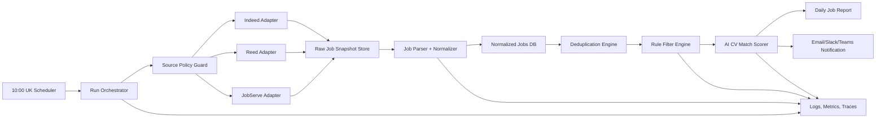
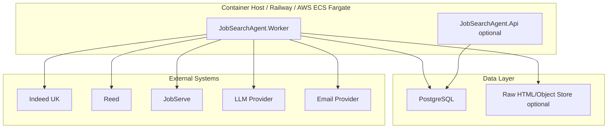
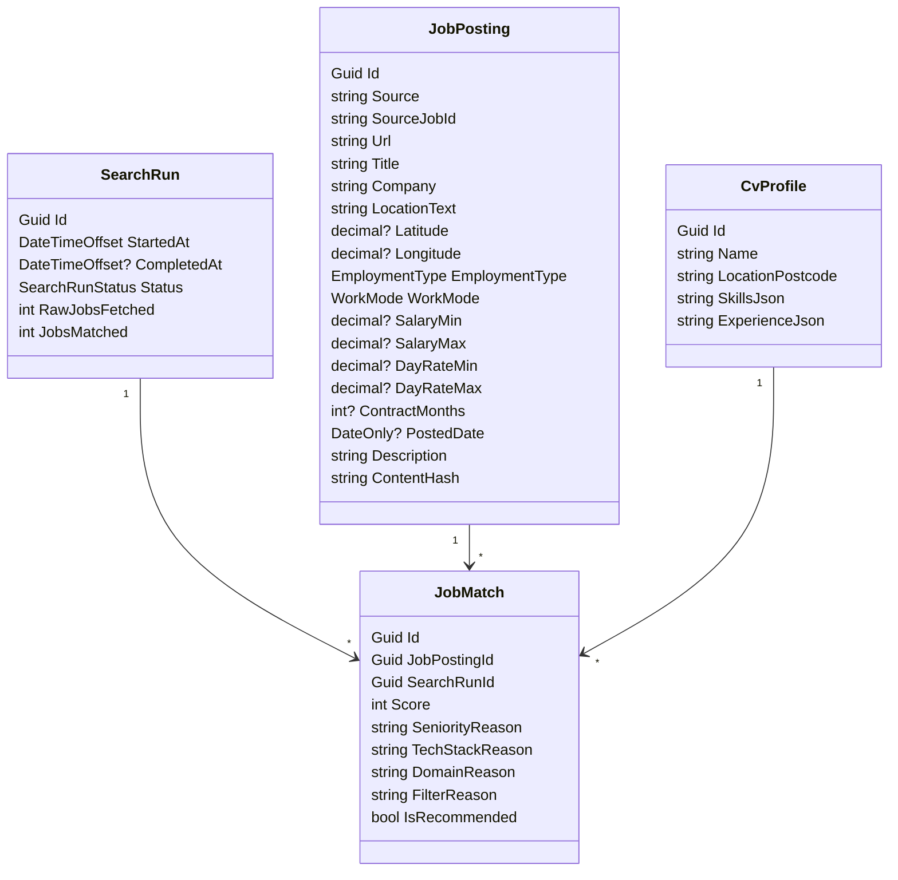
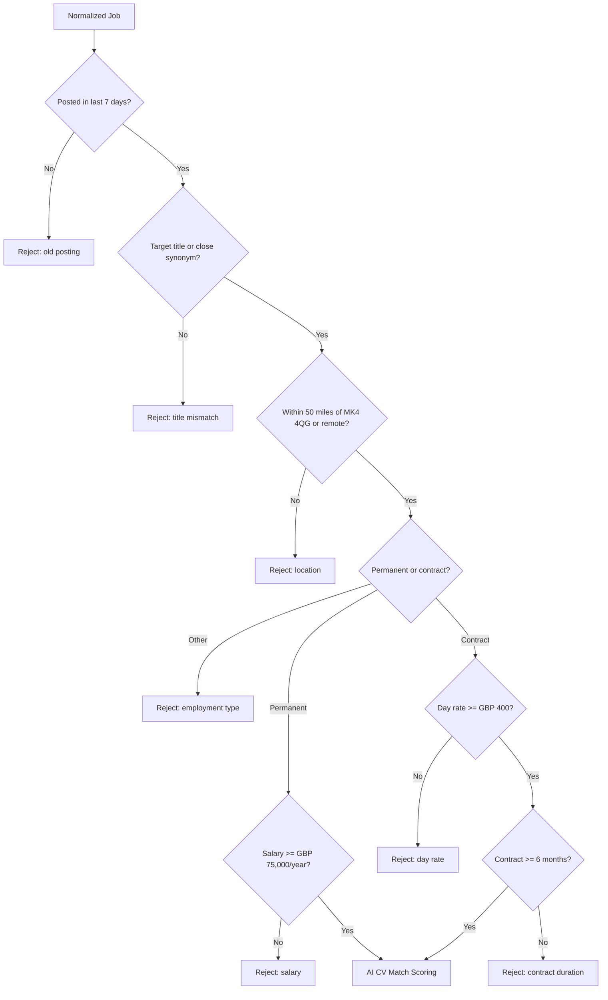
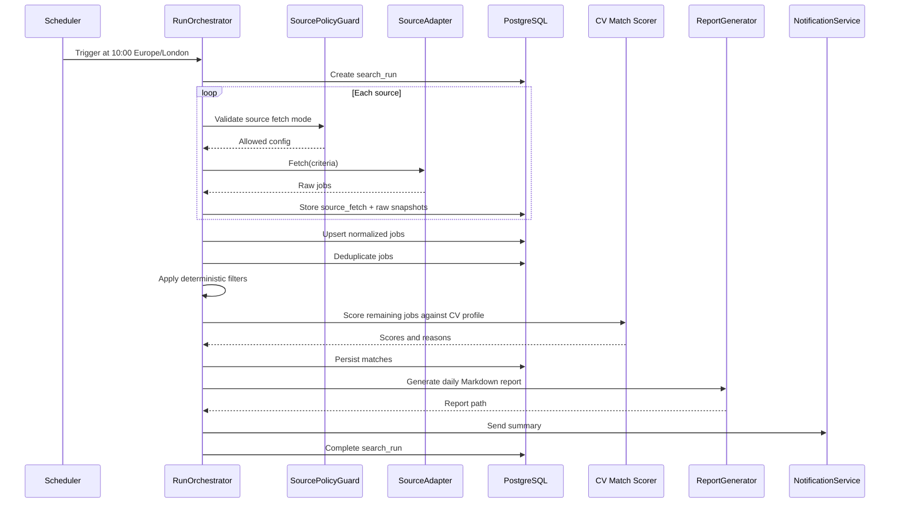
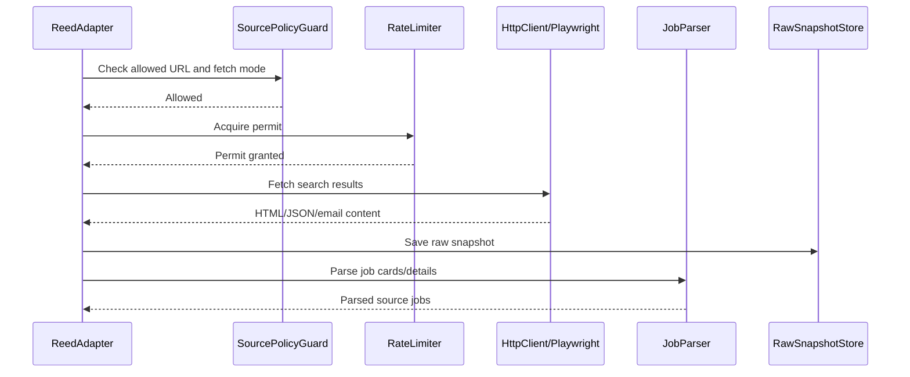
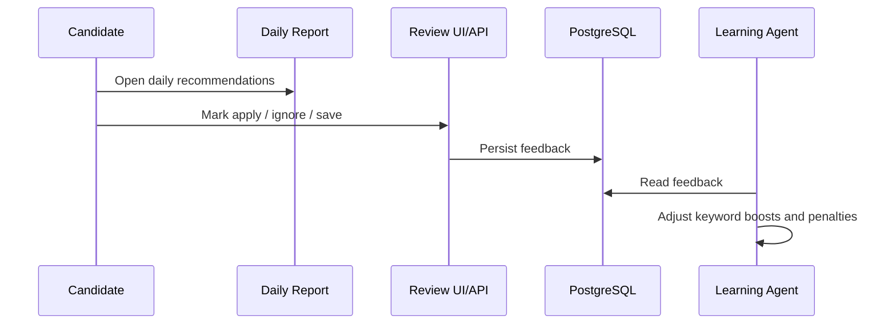
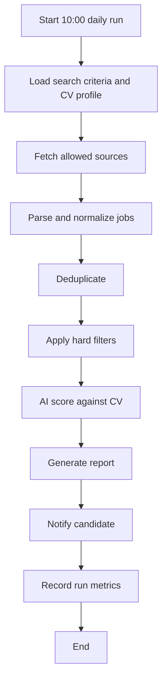
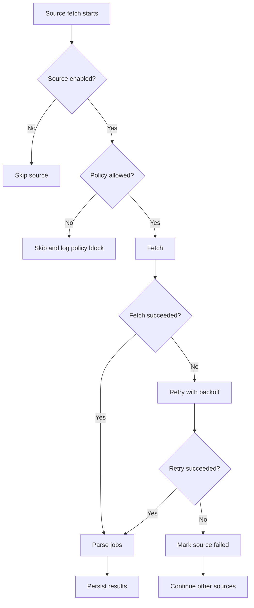
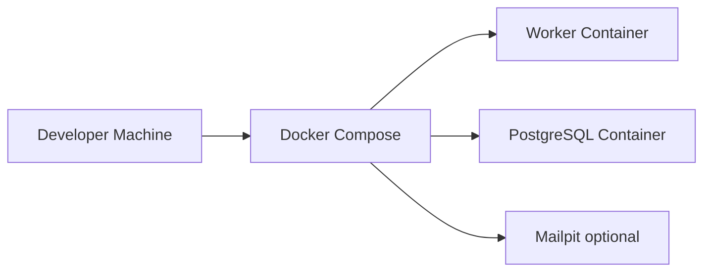

# AI Job Search Agent Architecture

**Status:** Proposed  
**Date:** 2026-05-30  
**Owner:** Ekanatha Reddy Urivakili  
**Primary location:** MK4 4QG, Milton Keynes, UK  
**Target role families:** Senior Software Engineer, Senior Fullstack Engineer, Lead Developer, Senior Software Developer  

## 1. Executive Summary

Build an automated AI job search agent that runs every morning at 10:00 UK time, searches selected UK job boards for the last 7 days of relevant IT/software jobs, filters by location, salary/day rate, employment type, and working pattern, then ranks results against the attached CV.

The system should not depend on unrestricted scraping. Indeed explicitly restricts automated access without permission in its legal terms, and Reed blocks `/api/` paths in `robots.txt`. The architecture therefore uses a compliance-first source adapter model:

- Prefer official APIs, partner feeds, saved searches, email alerts, RSS feeds, or exported alerts where available.
- Use public page crawling only when allowed by each site policy and `robots.txt`.
- Keep crawler rate limits, user-agent identification, audit logs, and kill switches per source.
- Do not bypass CAPTCHA, login walls, anti-bot systems, paywalls, or disallowed paths.

Sources in scope:

- [Indeed UK](https://uk.indeed.com)
- [Reed](https://www.reed.co.uk)
- [JobServe](https://www.jobserve.com)

Reference notes:

- Indeed legal terms include restrictions on automated systems without express permission.
- Reed `robots.txt` disallows `/api/` for general crawlers.
- JobServe candidate help recommends saved searches and daily alerts, which is a low-risk integration path.

## 2. Product Requirements

### 2.1 Functional Requirements

| ID | Requirement |
|---|---|
| FR-01 | Run automatically every day at 10:00 UK time. |
| FR-02 | Fetch jobs posted in the last 7 days. |
| FR-03 | Search within 50 miles of MK4 4QG. |
| FR-04 | Include permanent and contract jobs. |
| FR-05 | Include remote, hybrid, and 5-days-office roles. |
| FR-06 | Permanent jobs must have minimum salary of GBP 75,000 per year. |
| FR-07 | Contract jobs must have minimum rate of GBP 400 per day and minimum contract period of 6 months. |
| FR-08 | Match role titles: Senior Software Engineer, Senior Fullstack Engineer, Lead Developer, Senior Software Developer. |
| FR-09 | Match against CV skills and experience. |
| FR-10 | Deduplicate jobs across sources. |
| FR-11 | Rank jobs by fit score, salary/rate quality, recency, location, and match confidence. |
| FR-12 | Produce a daily Markdown/HTML/email report with matched jobs and reasoning. |
| FR-13 | Persist job history so previously seen jobs are not repeatedly reported unless updated. |

### 2.2 Non-Functional Requirements

| Category | Requirement |
|---|---|
| Compliance | Respect source terms, `robots.txt`, rate limits, and GDPR principles. |
| Reliability | One failed source must not fail the whole run. |
| Observability | Log source health, fetched count, parsed count, filtered count, and errors. |
| Explainability | Every recommended job must include filter reasons and CV-match reasons. |
| Maintainability | Each job board integration must be isolated behind a source adapter. |
| Security | Store credentials and API keys only in secret stores or local encrypted config. |
| Cost | Use a small scheduled container first; avoid over-engineering event streaming initially. |
| Testability | Parser, filter, scorer, and scheduler behavior must be independently testable. |

## 3. CV Match Profile

The attached CV is strongest for senior full-stack/backend/platform roles with the following themes:

| Area | Keywords |
|---|---|
| Backend | C#, ASP.NET Core, Web API, MVC, PHP 8, REST APIs, CQRS, microservices |
| Frontend | React, TypeScript, JavaScript, jQuery, HTML5, CSS3 |
| Cloud/DevOps | AWS RDS, S3, DynamoDB, QuickSight, Docker, Jenkins, CI/CD, Railway |
| Data | SQL Server, MySQL, PostgreSQL, MongoDB, Amazon RDS, BI dashboards, reporting |
| Commerce/Fintech | Magento 2.4, payments, D-Local, RedPay, marketplaces, e-commerce |
| Leadership | Agile, stakeholder management, engineering standards, team mentoring, LLDs |
| Target seniority | Senior Engineer, Lead Developer, Architect-leaning Senior Developer |

Primary match boosts:

- C#/.NET, ASP.NET Core, Web API
- React/TypeScript full-stack roles
- AWS cloud roles
- SQL/data-heavy backend roles
- Fintech, payments, marketplace, e-commerce, BI/reporting domains
- Lead developer or senior IC roles requiring mentoring and architecture input

Match penalties:

- Junior/mid-level roles
- Pure frontend roles with no backend ownership
- Roles below salary/rate thresholds
- Roles requiring onsite work far beyond 50 miles from MK4 4QG
- Contracts shorter than 6 months
- Roles requiring unrelated specialist stacks as primary skill, such as embedded, mainframe, SAP-only, Salesforce-only

## 4. High-Level Architecture



### 4.1 Recommended MVP Stack

| Layer | Recommendation | Reason |
|---|---|---|
| Runtime | .NET 8 Worker Service | Strong fit for the CV and background scheduling. |
| Scheduler | Cron inside container or GitHub Actions scheduled workflow | Simple MVP path. |
| Storage | PostgreSQL | Reliable relational filtering and history. |
| Queue | In-process first; add SQS/Hangfire later | Avoids premature complexity. |
| Browser automation | Playwright only where permitted | Handles dynamic pages without bypassing restrictions. |
| HTML parsing | AngleSharp in .NET | Structured HTML parsing. |
| AI scoring | OpenAI/Azure OpenAI compatible abstraction | Explainable ranking and CV matching. |
| Reporting | Markdown + optional email | Easy to inspect and version. |
| Deployment | Docker Compose locally, Railway/AWS later | Matches current stack and keeps operations simple. |
| Observability | Serilog + OpenTelemetry-ready metrics | Good enough for MVP, extensible later. |

### 4.2 Deployment View



## 5. Source Integration Strategy

### 5.1 Compliance Decision

**Decision:** Implement a `SourceAdapter` abstraction with a mandatory `SourcePolicyGuard` before fetching.

This protects the system from hard-coding unsafe scraping assumptions and allows each source to use the safest available integration path.

| Source | Preferred Access | Fallback | Notes |
|---|---|---|---|
| Indeed UK | Official/partner API, approved feed, saved job alerts | Manual import from alerts | Do not automate scraping unless written permission and `robots.txt` allow it. |
| Reed | Public search pages where permitted, official partner access if available | Daily alert import | Do not call disallowed `/api/` paths. |
| JobServe | Saved searches/email alerts, public search pages where permitted | Manual alert import | JobServe supports saved searches and daily alerts for candidates. |

### 5.2 Source Adapter Contract

```csharp
public interface IJobSourceAdapter
{
    string SourceName { get; }
    Task<SourceFetchResult> FetchAsync(JobSearchCriteria criteria, CancellationToken cancellationToken);
}
```

```csharp
public sealed record JobSearchCriteria(
    IReadOnlyCollection<string> Titles,
    string Postcode,
    int RadiusMiles,
    DateOnly PostedFrom,
    DateOnly PostedTo,
    IReadOnlyCollection<EmploymentType> EmploymentTypes,
    IReadOnlyCollection<WorkMode> WorkModes,
    Money MinimumPermanentSalary,
    Money MinimumContractDayRate,
    int MinimumContractMonths);
```

### 5.3 Fetch Modes

| Mode | Description | Use When |
|---|---|---|
| API/Feed | Fetch structured jobs from approved API/feed. | Source provides permission or partner access. |
| Alert Inbox | Read daily job alert emails and parse job cards/links. | Source restricts direct crawling or provides reliable alerts. |
| Search Page Crawl | Fetch public search result pages with rate limits. | Allowed by source terms and `robots.txt`. |
| Manual Import | Paste/export jobs into import folder. | Automation is not allowed or temporarily broken. |

## 6. Low-Level Design

### 6.1 Components

| Component | Responsibility |
|---|---|
| `Scheduler` | Triggers daily run at 10:00 Europe/London. |
| `RunOrchestrator` | Creates run record, calls source adapters, handles partial failures. |
| `SourcePolicyGuard` | Checks source config, allowed fetch mode, rate limits, disallowed paths, kill switch. |
| `IndeedAdapter` | Fetches Indeed results through approved mode only. |
| `ReedAdapter` | Fetches Reed results through approved mode only. |
| `JobServeAdapter` | Fetches JobServe results through approved mode only. |
| `RawSnapshotStore` | Stores raw source response and content hash for audit/debug. |
| `JobParser` | Extracts title, company, location, salary/rate, posted date, URL, description. |
| `JobNormalizer` | Maps source-specific fields to canonical `JobPosting`. |
| `DeduplicationEngine` | Merges likely duplicates using URL, company, title, location, and text fingerprints. |
| `RuleFilterEngine` | Applies deterministic filters before AI scoring. |
| `CvMatchScorer` | Uses CV profile and job description to produce score and reasons. |
| `ReportGenerator` | Creates daily Markdown report and optional HTML/email. |
| `NotificationService` | Sends report link/summary via email or Teams. |
| `ObservabilityService` | Emits logs, metrics, and run summaries. |

### 6.2 Package Layout

```text
src/
  JobSearchAgent.Domain/
    Jobs/
    Matching/
    Sources/
  JobSearchAgent.Application/
    Runs/
    Filtering/
    Scoring/
    Reporting/
  JobSearchAgent.Infrastructure/
    Sources/
      Indeed/
      Reed/
      JobServe/
    Persistence/
    Llm/
    Email/
  JobSearchAgent.Worker/
  JobSearchAgent.Api/
tests/
  JobSearchAgent.UnitTests/
  JobSearchAgent.IntegrationTests/
  JobSearchAgent.E2ETests/
```

### 6.3 Domain Model



### 6.4 PostgreSQL Tables

| Table | Purpose |
|---|---|
| `search_runs` | One row per scheduled run. |
| `source_fetches` | Per-source status, duration, counts, error details. |
| `raw_job_snapshots` | Raw HTML/JSON/email body metadata and content hash. |
| `job_postings` | Canonical job records. |
| `job_matches` | Scoring output and explainability. |
| `job_seen_history` | Prevents repeated notifications for unchanged jobs. |
| `source_policies` | Allowed mode, rate limit, enabled flag, last policy review date. |
| `cv_profiles` | Extracted CV skills and match configuration. |

### 6.5 Filtering Rules



### 6.6 AI Match Scoring

The AI scorer should run only after deterministic filters pass. This keeps costs low and makes the system explainable.

| Score Area | Weight |
|---|---:|
| Core technical match | 35 |
| Seniority and leadership match | 20 |
| Domain match | 15 |
| Cloud/DevOps/data match | 10 |
| Salary/rate attractiveness | 10 |
| Location/work-mode fit | 5 |
| Recency | 5 |

Recommended thresholds:

| Score | Meaning |
|---:|---|
| 85-100 | Strong apply-now match |
| 70-84 | Good match, review manually |
| 55-69 | Possible match |
| 0-54 | Do not recommend |

Example structured scorer output:

```json
{
  "score": 88,
  "recommended": true,
  "reasons": [
    "Strong C# ASP.NET Core and REST API match",
    "Senior/lead responsibilities align with 15 years of experience",
    "AWS, SQL, Docker, and CI/CD overlap",
    "Fintech/e-commerce domain overlap"
  ],
  "risks": [
    "Role requires 3 days onsite; confirm commute"
  ]
}
```

## 7. Sequence Diagrams

### 7.1 Daily Scheduled Run



### 7.2 Source Adapter Fetch



### 7.3 Human Review Loop



## 8. Flow Charts

### 8.1 End-to-End Flow



### 8.2 Error Handling Flow



## 9. Search Criteria Configuration

Example `appsettings.json`:

```json
{
  "SearchCriteria": {
    "Postcode": "MK4 4QG",
    "RadiusMiles": 50,
    "PostedWithinDays": 7,
    "RunAtLocalTime": "10:00",
    "TimeZone": "Europe/London",
    "Titles": [
      "Senior Software Engineer",
      "Senior Fullstack Engineer",
      "Lead Developer",
      "Senior Software Developer"
    ],
    "EmploymentTypes": ["Permanent", "Contract"],
    "WorkModes": ["Remote", "Hybrid", "Office"],
    "MinimumPermanentSalaryGbp": 75000,
    "MinimumContractDayRateGbp": 400,
    "MinimumContractMonths": 6
  }
}
```

## 10. DevOps Architecture

### 10.1 Local Development



Local services:

- `postgres`
- `jobsearchagent-worker`
- `mailpit` for email preview
- optional local object store such as MinIO if raw snapshots are stored outside PostgreSQL

### 10.2 CI/CD

Pipeline stages:

1. Restore/build.
2. Unit tests.
3. Integration tests with PostgreSQL test container.
4. Parser fixture tests.
5. Static analysis and secret scanning.
6. Build Docker image.
7. Deploy worker.
8. Run smoke test.

### 10.3 Runtime Operations

| Concern | Design |
|---|---|
| Secrets | Environment variables or cloud secret manager. |
| Scheduling | Cron expression: `0 10 * * *` in Europe/London-aware scheduler. |
| Logs | Structured JSON logs with `runId`, `source`, `jobId`. |
| Alerts | Notify when all sources fail or zero jobs found for multiple days. |
| Backups | Daily PostgreSQL backup. |
| Feature flags | Per-source `enabled` and `fetchMode`. |
| Rollback | Previous container image and database migration rollback script. |

## 11. QA Automation Strategy

### 11.1 Test Pyramid

| Layer | Tests |
|---|---|
| Unit | Salary parser, day-rate parser, duration parser, title matcher, distance filter, deduper. |
| Integration | PostgreSQL persistence, source adapter fixtures, report generation. |
| Contract | Source adapter output must map to canonical `JobPosting`. |
| E2E | Simulated daily run using saved HTML/email fixtures. |
| Non-functional | Rate limit tests, retry tests, source failure isolation, duplicate suppression. |

### 11.2 Parser Fixture Tests

Store anonymized fixtures:

```text
tests/fixtures/
  indeed/
  reed/
  jobserve/
  emails/
```

Each fixture test should assert:

- job title parsed
- company parsed
- source URL parsed
- posted date parsed
- salary/rate parsed
- employment type parsed
- work mode parsed
- invalid/missing salary handled deterministically

### 11.3 Acceptance Criteria

| Scenario | Expected Result |
|---|---|
| Permanent role at GBP 80,000 within 20 miles | Included and scored. |
| Permanent role at GBP 70,000 | Rejected. |
| Contract role at GBP 450/day for 3 months | Rejected. |
| Contract role at GBP 400/day for 6 months | Included and scored. |
| Remote role outside 50 miles | Included if UK remote is acceptable. |
| Onsite role 70 miles away | Rejected. |
| Same job appears on Reed and JobServe | One canonical job with multiple source references. |
| Indeed source policy disabled | Indeed skipped with policy-block log, run continues. |

## 12. Security, Privacy, and Compliance

Security controls:

- Do not store plaintext credentials.
- Use a dedicated email inbox/token for job alerts.
- Encrypt secrets at rest.
- Keep raw snapshots for a short retention period, such as 30 days.
- Avoid storing unnecessary personal data from recruiters or hiring managers.
- Do not automate login, CAPTCHA solving, or anti-bot bypass.
- Add per-source policy review dates.

Compliance controls:

- `SourcePolicyGuard` blocks disabled or disallowed source modes.
- Fetchers respect `robots.txt` and configured crawl delays.
- User-agent identifies the project and contact email when crawling is permitted.
- Audit log records source URL, fetch mode, timestamp, and policy decision.
- Kill switch can disable any source immediately.

## 13. Architecture Decisions

### ADR-001: Use Source Adapter Pattern

**Status:** Proposed

**Decision:** Implement each job board as an isolated `IJobSourceAdapter`.

**Why:** Job boards differ in terms, page structure, alert behavior, and available integrations. Isolating each source prevents parser changes from leaking into core filtering/scoring.

**Consequences:**

- Easier to disable or replace one source.
- Slightly more boilerplate.
- Better testability through adapter fixtures.

### ADR-002: Deterministic Filters Before AI Scoring

**Status:** Proposed

**Decision:** Apply salary, rate, distance, date, title, and contract duration filters before LLM scoring.

**Why:** Hard constraints should be explainable, fast, and cheap. AI should rank plausible jobs, not decide basic eligibility.

**Consequences:**

- Lower LLM cost.
- Easier QA automation.
- Some borderline jobs may be rejected before semantic scoring unless synonym rules are maintained.

### ADR-003: PostgreSQL as System of Record

**Status:** Proposed

**Decision:** Store runs, jobs, source fetches, and matches in PostgreSQL.

**Why:** The data is relational and requires history, deduplication, filtering, and reporting.

**Consequences:**

- Simple backups and querying.
- Good local and cloud support.
- Object storage may be added later for large raw snapshots.

### ADR-004: Alert/API First, Crawl Second

**Status:** Proposed

**Decision:** Prefer official APIs, approved feeds, and job alert ingestion before public page crawling.

**Why:** Source terms and anti-bot controls can make scraping fragile or prohibited. Alert/API ingestion is safer and more reliable.

**Consequences:**

- Initial setup may require source accounts or partner access.
- Some results may depend on saved search quality.
- Compliance risk is lower.

## 14. Implementation Roadmap

### Phase 1: MVP

1. Create .NET Worker Service and PostgreSQL schema.
2. Add search criteria configuration.
3. Implement CV profile extraction from the attached CV.
4. Implement deterministic filter engine.
5. Implement Reed and JobServe adapters using permitted alert/public-page modes.
6. Add Indeed adapter behind disabled policy until approved access is confirmed.
7. Generate Markdown report.
8. Add unit tests and fixture tests.
9. Run locally with Docker Compose.

### Phase 2: Quality and Automation

1. Add email alert ingestion.
2. Add deduplication fingerprint improvements.
3. Add LLM CV scoring with structured JSON output.
4. Add daily email delivery.
5. Add source health dashboard.
6. Add feedback loop for apply/save/ignore.

### Phase 3: Production Hardening

1. Deploy to Railway or AWS ECS Fargate.
2. Add secret manager integration.
3. Add OpenTelemetry metrics.
4. Add backup and retention policies.
5. Add source policy review workflow.
6. Add optional review UI/API.

## 15. Open Questions

| Question | Owner |
|---|---|
| Should the first version ingest job alert emails instead of crawling public pages? | Product / Architect |
| Is Indeed approved API/feed access available? | Product / DevOps |
| Should remote roles include all UK remote roles or only remote roles listing a nearby office? | Product |
| What email provider should send the daily report? | DevOps |
| Should the agent auto-prepare tailored CV/cover-letter drafts after ranking? | Product / Architect |

## 16. Senior Stakeholder Review

### Principal Engineer View

- Keep core domain independent of source-specific HTML.
- Use fixtures for every parser.
- Avoid LLM calls in core eligibility rules.
- Make source policies data-driven.

### Senior Product Manager View

- MVP value is a reliable daily shortlist, not full automation.
- Report should show why each role is recommended.
- Feedback buttons should improve future matching.
- Contract and permanent roles should be separated in the report.

### Senior QA Automation Engineer View

- Build deterministic test fixtures before adding live source variability.
- Validate edge cases around salary strings, day rates, and contract duration.
- Add regression tests when source markup changes.
- Simulate source failure and partial-result runs.

### Senior DevOps Engineer View

- Start with a scheduled worker container and PostgreSQL.
- Use per-source kill switches.
- Add structured logs from day one.
- Keep secrets out of repository and reports.

## 17. Daily Report Format

```markdown
# Daily Job Matches - 2026-05-30

Search:
- Location: MK4 4QG + 50 miles
- Posted: last 7 days
- Permanent: >= GBP 75,000/year
- Contract: >= GBP 400/day, >= 6 months

## Strong Matches

### 1. Senior Software Engineer - Example Company
- Source: Reed
- Location: Milton Keynes / Hybrid
- Type: Permanent
- Salary: GBP 85,000
- Posted: 2026-05-28
- Score: 91
- Why: Strong ASP.NET Core, React, AWS, SQL, senior delivery match.
- URL: ...

## Good Matches

...

## Rejected Summary

| Reason | Count |
|---|---:|
| Below salary/rate threshold | 14 |
| Outside radius | 8 |
| Old posting | 6 |
| Title mismatch | 21 |
```

## 18. Source References

- Indeed legal terms: [https://uk.indeed.com/legal](https://uk.indeed.com/legal)
- Reed robots file: [https://www.reed.co.uk/robots.txt](https://www.reed.co.uk/robots.txt)
- JobServe candidate help: [https://www.jobserve.com/en/content/help/faqs/candidate.htm](https://www.jobserve.com/en/content/help/faqs/candidate.htm)
