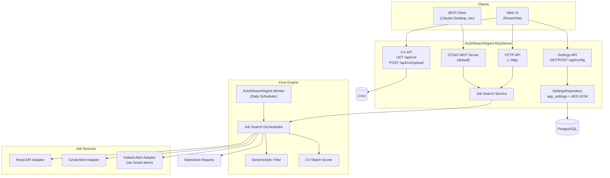
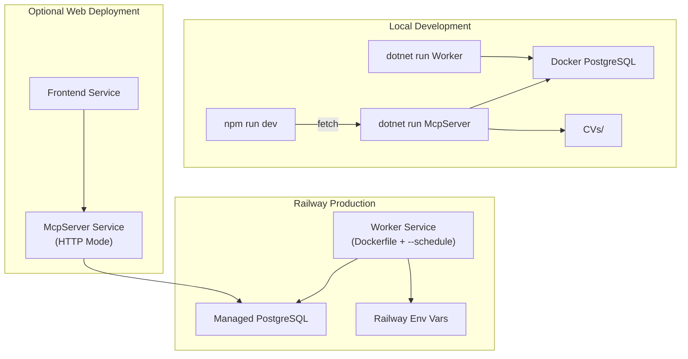
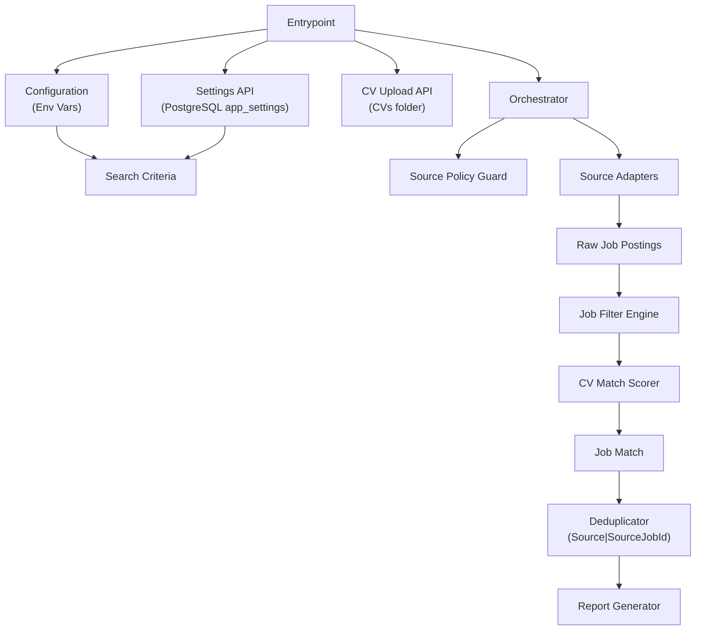
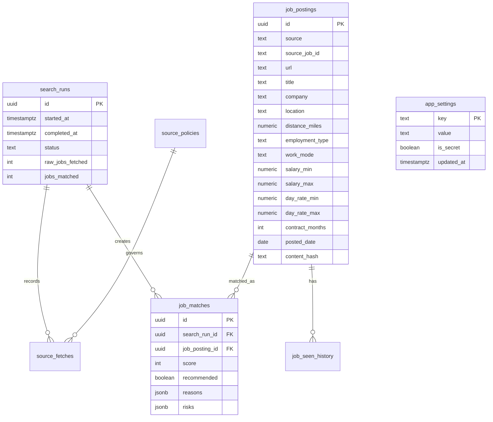
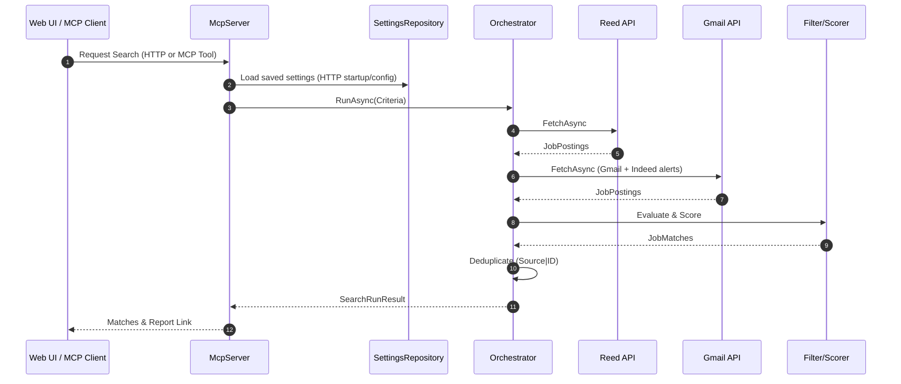
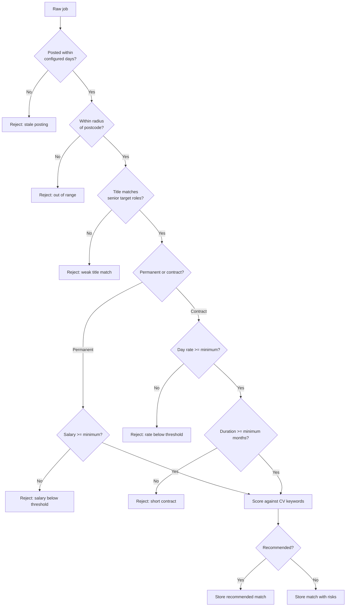

# AI Job Search Agent Architecture

## Current Repository Reality

This repository contains a full .NET and React implementation of an automated job search agent:

- `src/AiJobSearchAgent.Core`: Domain models, filtering, and scoring logic.
- `src/AiJobSearchAgent.McpServer`: Dual-mode server (MCP STDIO for AI clients, HTTP for the Web UI), settings API, CV upload API, and live source integrations.
- `src/AiJobSearchAgent.Worker`: Daily scheduler and reporter.
- `frontend/`: React/Vite/TypeScript dashboard.
- `tests/AiJobSearchAgent.Tests`: Regression tests for filtering and scoring.
- `docker-compose.yml` & `Dockerfile`: Containerization.
- `railway.toml`: Deployment configuration.
- `sql/init/001_schema.sql`: PostgreSQL schema.
- `CVs/`: Local CV upload storage for `.pdf`, `.docx`, and `.md` files.

## High-Level Design

## Deployment View

## Logical Low-Level Design

### Core Components

| Component | Responsibility | Status |
|---|---|---|
| Core Engine | Filtering, scoring, and orchestration. | Production-ready |
| MCP Server | Provides tools/resources to AI clients via STDIO. | Live |
| HTTP API | Provides data to the Web UI. | Live (in McpServer) |
| Settings API | Saves configurable settings, encrypting secrets in PostgreSQL. | Live |
| CV Upload API | Lists and uploads `.pdf`, `.docx`, and `.md` CV files into `CVs/`. | Live |
| Worker | Daily scheduled runs and local reports. | Live |
| Reed Adapter | Fetches and maps jobs from Reed API. | Live |
| Gmail Adapter | Reads Gmail job alerts using configured service account JSON. | Live |
| Indeed Adapter | Parses Indeed alert emails from Gmail. | Live |
| Deduplicator | Ensures unique results by source job ID. | Live |

## Data Model

## Run Sequence (HTTP/MCP)

## Job Evaluation Flow

## Architecture Documentation

See `docs/job-search-agent-architecture.md` (this file).

MCP job-site integration plan: `docs/mcp-job-sites-integration-plan.md`.
