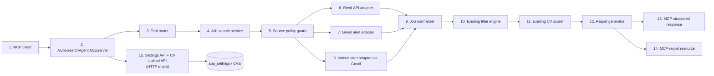
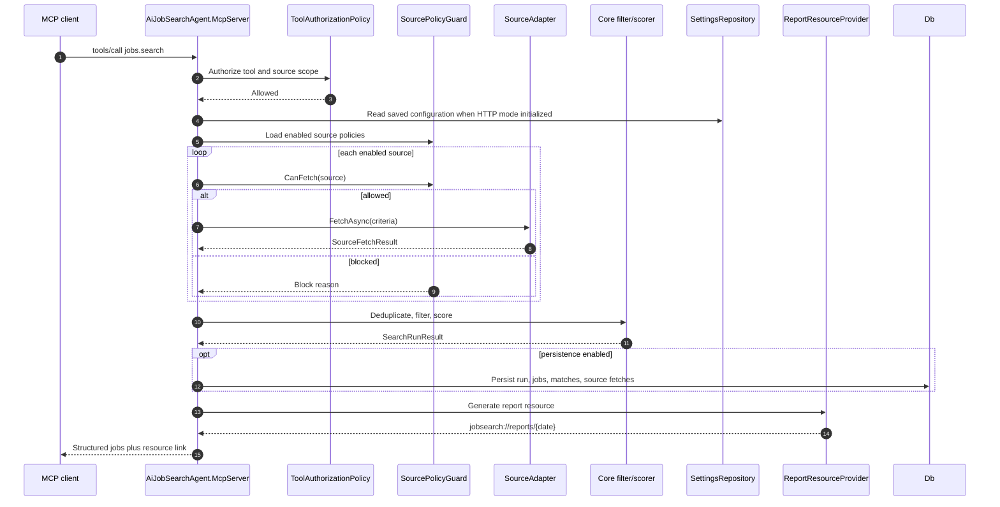
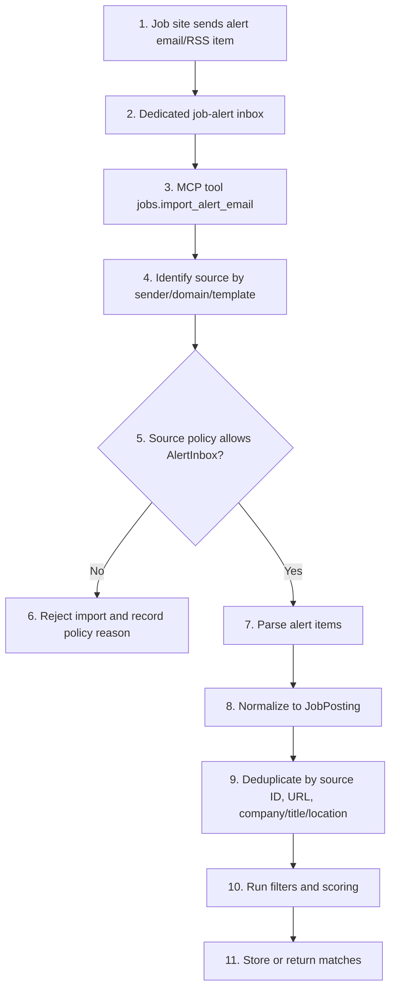
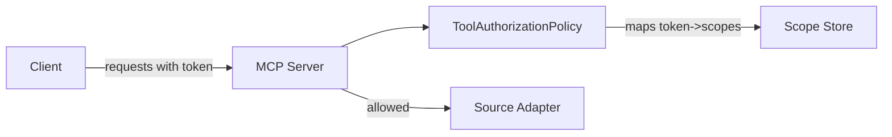
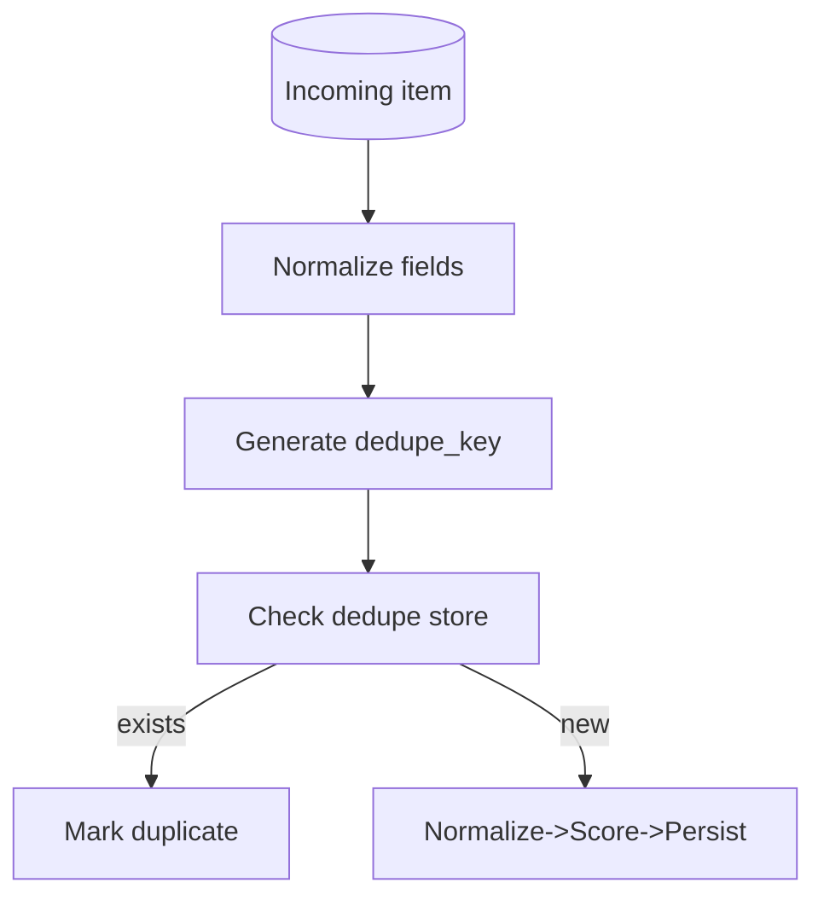

# MCP Job Sites Integration Plan

**Status:** In progress; Reed API, Gmail alerts, Indeed alert emails, HTTP dashboard config, and CV upload are implemented.
**Date:** 2026-06-03
**Scope:** MCP server integration for UK job discovery from Reed, Gmail Alerts, and Indeed alert emails.
**Architecture stance:** Compliance-first. The MCP server must wrap approved APIs, alert inboxes, RSS feeds, or manual imports. It must not bypass login walls, CAPTCHA, anti-bot controls, paywalls, disallowed `robots.txt` paths, or source terms.

## 1. Executive Decision

Build a dedicated `AiJobSearchAgent.McpServer` that exposes job-search tools to an AI client while delegating source-specific retrieval to policy-gated adapters.

Phase 1 should start with a local STDIO MCP server using the official C# SDK package, then add HTTP only when deployment and authorization requirements are explicit. Reed can be implemented immediately behind `REED_API_KEY`; if the key is absent, Reed must surface as not ready instead of falling back to sample data or web scraping.

The MCP server should not be a scraping bot. It should be a controlled integration boundary:

1. Accept natural-language or structured job search requests from an MCP client.
2. Resolve them into `JobSearchCriteria`.
3. Fetch jobs only through approved source modes.
4. Normalize all results into the existing `JobPosting` model.
5. Run deterministic filters and CV scoring through the current core engine.
6. Return structured results plus report resources to the MCP client.

## 1.1 Senior Architect Review Findings

| ID | Finding | Impact | Decision |
|---|---|---|---|
| F-01 | The original Phase 1 was blocked on transport and Reed credentials, but a local STDIO transport is enough to start safely. | Avoids delaying core tool contracts and policy gating. | Start Phase 1 with STDIO; add HTTP as a later deployment option. |
| F-02 | The plan omitted the official C# MCP SDK, even though it is now the right default for this .NET repository. | Hand-written JSON-RPC would create avoidable protocol drift. | Use `ModelContextProtocol` for STDIO and tools; use `ModelContextProtocol.AspNetCore` only when HTTP is needed. |
| F-03 | STDIO transport cannot tolerate normal console logging on stdout. | Host logs can corrupt MCP protocol messages. | Clear default logging providers or route logs away from stdout before productionizing. |
| F-04 | `jobs.search` needs readiness semantics for sources requiring imported alerts or secrets. | Clients otherwise cannot distinguish "no jobs" from "not configured". | `sources.health` is mandatory before live source use and must expose `ready`, `requiredSecret`, mode, and policy state. |
| F-05 | Reed URL provenance remains a hard requirement. | Constructed URLs can break or mislead downstream report consumers. | Skip Reed jobs that lack an API-provided absolute `jobUrl`; do not synthesize URLs in the contract. |
| F-06 | Alert-only sources require durable imported data before they can participate in search. | Empty adapters would hide missing ingestion work. | Runtime source registration is limited to Reed, Gmail Alerts, and Indeed UK. Removed sources require a fresh approved-access design before reintroduction. |

## 2. Source Findings

| Source | Recommended mode | Secondary mode | Do not do | Evidence |
|---|---|---|---|---|
| Reed | Official Reed Jobseeker API | Reed job alert email ingestion | Do not crawl `/api/` as a generic bot; use the API key flow. | Reed documents search and job details API endpoints and requires the API key in basic auth. Reed help also supports saved searches and daily or weekly email alerts. |
| Indeed | Indeed Job Alert email ingestion (✅ implemented — AlertInbox via Gmail) | Approved Indeed partner API if access is granted | Do not scrape Indeed search pages or automate access without permission. | Indeed support documents job alerts for signed-in accounts. `IndeedAlertJobSourceAdapter` parses `from:jobalerts-noreply@indeed.com` emails via the Gmail service account. |

## 3. MCP Server HLD



## 4. MCP Server LLD

### 4.1 Project Layout

Initial Phase 1 keeps the MCP project flat because the server currently has one transport, one live adapter, and no persistence. Split into the folder layout below when alert ingestion, resources, or HTTP deployment are added.

```text
src/
  AiJobSearchAgent.Core/
  AiJobSearchAgent.Worker/
  AiJobSearchAgent.McpServer/
    Program.cs
    Contracts.cs
    CredentialProvider.cs
    JobSearchMcpService.cs
    McpJobSearchTools.cs
    PolicyBlockedSourceAdapter.cs
    ReedApiJobSourceAdapter.cs
```

### 4.2 MCP Tools

| Tool | Purpose | Writes? | Source access |
|---|---|---:|---|
| `jobs.search` | Search configured sources and return filtered/scored jobs. | No, unless persistence is enabled. | Reed API, Gmail alert emails, and Indeed Gmail alerts. |
| `jobs.get` | Fetch one normalized job by source and source job ID. | No | Reed job details API, local DB, alert cache, or approved source API. |
| `jobs.import_alert_email` | Import a user-provided alert email body or mailbox message ID. | Yes | Local alert inbox or pasted email content. Current runtime alert ingestion uses Gmail-backed adapters; clients should call `sources.health` to see whether alert sources have importable content ready. |
| `jobs.generate_report` | Generate a Markdown report from a search run or supplied job list. | Yes | Local report filesystem and optional DB. |
| `sources.health` | Show source policy, last fetch status, and integration mode. | No | Local DB/config only. |
| `sources.review_policy` | Return compliance checklist for a source before enabling it. | No | Local source policy metadata. |

### 4.3 MCP Resources

| Resource URI | Content |
|---|---|
| `jobsearch://reports/latest` | Latest Markdown report. |
| `jobsearch://reports/{date}` | Report for a specific date. |
| `jobsearch://sources/policies` | Current source policies, enabled flags, fetch modes, review dates. |
| `jobsearch://runs/{runId}` | Run summary, source fetch results, match counts, rejection summary. |
| `jobsearch://jobs/{source}/{sourceJobId}` | Canonical normalized job details from local cache or DB. |

## 5. Source Adapter Plan

### 5.1 Reed Adapter

**Priority:** Phase 1.

Use the official Reed Jobseeker API as the primary path.

Implementation notes:

1. Store `REED_API_KEY` in environment or secret store.
2. Call Reed search API with `keywords`, `locationName`, `distanceFromLocation`, `permanent`, `contract`, `minimumSalary`, `resultsToTake`, and `resultsToSkip`.
3. Call Reed job details API for shortlisted results where details are incomplete.
4. Map salary type carefully, especially `per day` and `per annum`.
5. Keep Reed email alerts as a fallback and reconciliation source.

Policy:

```json
{
  "sourceName": "Reed",
  "fetchMode": "ApprovedApi",
  "enabled": true,
  "minimumDelaySeconds": 3,
  "requiresSecret": "REED_API_KEY"
}
```

### 5.2 Indeed Adapter

**Priority:** Phase 2 — ✅ implemented 2026-06-03 via `AlertInbox` (Gmail alert email ingestion).

`IndeedAlertJobSourceAdapter` reads Indeed job alert emails from the Gmail inbox using the shared `GMAIL_CREDENTIALS_JSON` service account delegated to `GMAIL_USER_EMAIL`. The adapter:

1. Queries Gmail with `INDEED_GMAIL_SEARCH_QUERY` (default: `from:jobalerts-noreply@indeed.com is:unread`).
2. Parses each email's HTML body using HtmlAgilityPack.
3. Extracts the stable Indeed job key (`jk` URL parameter) as `SourceJobId`.
4. Derives a canonical URL `https://uk.indeed.com/viewjob?jk={jk}`.
5. Infers title, company, location, salary, employment type, and work mode from surrounding email elements.
6. Does not web-crawl Indeed — ingestion is purely from candidate-owned email alerts.

Implementation notes:

- `IndeedAlertJobSourceAdapter` lives in `AiJobSearchAgent.Core/Sources.cs` alongside `GmailAlertJobSourceAdapter`.
- `JobSearchMcpService.CreatePolicies()` enables Indeed UK automatically when `GMAIL_CREDENTIALS_JSON` and `GMAIL_USER_EMAIL` are set.
- `INDEED_GMAIL_SEARCH_QUERY` overrides the default Gmail filter.
- `ParseFixture` static helper allows unit testing without Gmail credentials.

Policy (live):

```json
{
  "sourceName": "Indeed UK",
  "fetchMode": "AlertInbox",
  "enabled": true,
  "minimumDelaySeconds": 10,
  "requiredSecret": "GMAIL_CREDENTIALS_JSON and GMAIL_USER_EMAIL",
  "lastReviewedOn": "2026-06-03"
}
```

## 6. MCP Search Sequence



## 7. Alert Inbox Flow



## 8. API and Data Contracts

### 8.1 `jobs.search` Input

```json
{
  "keywords": ["Senior Software Engineer", "Lead Developer"],
  "postcode": "MK4 4QG",
  "radiusMiles": 50,
  "postedWithinDays": 7,
  "employmentTypes": ["Permanent", "Contract"],
  "workModes": ["Remote", "Hybrid", "Office"],
  "minimumPermanentSalaryGbp": 75000,
  "minimumContractDayRateGbp": 400,
  "minimumContractMonths": 6,
  "sources": ["Reed", "Gmail Alerts", "Indeed UK"]
}
```

### 8.2 `jobs.search` Output

```json
{
  "runId": "018f0000-0000-7000-9000-000000000001",
  "reportResource": "jobsearch://reports/2026-05-31",
  "sourceStatus": [
    {
      "source": "Reed",
      "status": "Succeeded",
      "jobsFetched": 42,
      "mode": "ApprovedApi"
    }
  ],
  "matches": [
    {
      "source": "Reed",
      "sourceJobId": "56946737",
      "title": "Security Architect",
      "company": "Pontoon",
      "location": "London",
      "score": 82,
      "recommended": true,
      "reasons": ["Senior role", "Architecture match", "Day-rate visible"],
      "risks": ["Hybrid 3 days onsite requires commute review"],
      "url": "https://www.reed.co.uk/jobs/security-architect-api-product-security/56946737"
    }
  ],
  "rejectedSummary": {
    "Below salary threshold": 12,
    "Title mismatch": 18
  }
}
```

**`url` field provenance:** `url` must come from the Reed API job details response field, not be constructed from `sourceJobId`. Reed's search endpoint may not return a full canonical URL — verify before finalising this contract. If the search endpoint omits it, call the job details endpoint for shortlisted results only and use that URL. If constructing URLs from `sourceJobId` turns out to be necessary, document the URL pattern and version it in the adapter, not the contract.

## 9. Security Controls

| Control | Requirement |
|---|---|
| Secret storage | API keys, service-account JSON, webhook URLs, and encryption keys must live in environment variables, PostgreSQL encrypted settings, or a secret store, not source control. |
| Tool allowlist | Only expose read/search/report tools by default. Any future apply/save-message tool must require explicit user approval. |
| Source policy | Every adapter call must pass through `SourcePolicyGuard`. |
| Audit logging | Log run ID, source, fetch mode, request parameters minus secrets, result counts, and policy decisions. |
| Rate limiting | Apply per-source limits even for APIs. Use backoff on 429/5xx. |
| PII minimization | Store job data and recruiter contact details only when needed for the report. Avoid storing unrelated email body content after parsing. |
| Token isolation | MCP server token and upstream API tokens must be distinct. Do not pass upstream tokens through to the MCP client. |

## 10. Implementation Phases

### Phase 1: Local MCP Server and Reed API

**Transport decision:** STDIO for local MCP clients.

**Credential decision:** `REED_API_KEY` is optional at startup. Reed policy is `ApprovedApi` but not enabled/ready when the secret is absent.

1. Add `src/AiJobSearchAgent.McpServer`. **Started 2026-06-01.**
2. Expose `jobs.search`, `jobs.get`, `jobs.generate_report`, and `sources.health`. **Started 2026-06-01.**
3. Implement Reed API adapter. **Started 2026-06-01; requires live `REED_API_KEY` validation.**
4. Keep sources not registered unless they have an approved API or Gmail-backed alert ingestion path.
5. Add tests for tool schemas, policy gating, Reed mapping, and filter/scorer reuse.

### Phase 2: Alert Inbox Integration

1. Add mailbox or `.eml` import abstraction.
2. ✅ Implement Gmail alert parser with source policy set to `AlertInbox`. — done 2026-06-03
3. ✅ Implement Indeed alert parser with source policy set to `AlertInbox`. — done 2026-06-03
4. Add alert fixture tests for each source template.
5. Persist imported alert hashes to avoid duplicate reporting.

### Phase 3: Persistence and Review UX

1. Wire PostgreSQL repositories to existing schema.
2. Add `jobsearch://runs/{runId}` and `jobsearch://jobs/{source}/{sourceJobId}` resources.
3. Add `sources.review_policy` to show why a source is enabled or blocked.
4. Add source health metrics and last-success timestamps.

### Phase 4: Future Approved Source Paths

1. Add a source only after the access mode is explicitly approved and documented.
2. Revisit Indeed approved API only after access is granted and documented.
3. Keep unapproved sources out of runtime policy, adapter registration, source health, and UI output.

## 11. Acceptance Criteria

| ID | Acceptance criterion |
|---|---|
| AC-01 | `jobs.search` can search Reed via API without touching web pages. |
| AC-02 | Runtime source output contains only configured supported sources. |
| AC-03 | Gmail and Indeed alerts can be imported from fixtures and normalized into `JobPosting`. |
| AC-04 | Removed sources do not appear in source policies, source health, search results, settings UI, docs, or diagrams. |
| AC-05 | Every MCP tool has typed input and structured output. |
| AC-06 | Every source call records source, mode, count, warnings, and policy decision. |
| AC-07 | No secrets appear in logs, reports, test fixtures, or git diffs. |

## 12. Open Questions

1. Will this MCP server run locally over STDIO, remotely over HTTP, or both?
   - **Decision 2026-06-01:** STDIO first. HTTP remains a Phase 3 deployment concern.
2. Do you already have a Reed API key?
   - **Decision 2026-06-01:** Implementation must not require the key to start. Reed is not ready until `REED_API_KEY` is configured.
3. Should alert ingestion use Gmail, Outlook, IMAP, or pasted `.eml` files first?
4. Should the MCP server only search, or should it eventually support applying/saving jobs with explicit approval?

## 13. References Reviewed

1. Model Context Protocol server concepts: `https://modelcontextprotocol.io/docs/learn/server-concepts`
2. Model Context Protocol tools specification: `https://modelcontextprotocol.io/specification/2025-06-18/server/tools` *(verify this URL resolves to the current spec version before publishing)*
3. Model Context Protocol authorization specification: `https://modelcontextprotocol.io/specification/2025-06-18/basic/authorization` *(same — date in URL predates document date of 2026-06-01; confirm spec has not been superseded)*
4. Reed Jobseeker APIs: `https://www.reed.co.uk/developers/jobseeker`
5. Reed job search and alerts help: `https://www.reed.co.uk/help/searching`
6. Reed robots file: `https://www.reed.co.uk/robots.txt`
7. Indeed Partner Job Sync API: `https://docs.indeed.com/job-sync-api/`
8. Indeed Jobs API details page: `https://docs.indeed.com/api/jobs-api/get-using-get-1`
9. Indeed job alerts support: `https://support.indeed.com/hc/en-gb/articles/204488890`
10. Official MCP C# SDK package: `https://www.nuget.org/packages/ModelContextProtocol`
11. MCP SDK list showing C# as a Tier 1 SDK: `https://modelcontextprotocol.io/docs/sdk`
 
## 14. Operational Appendix

This appendix captures concrete operational decisions, security, testing, schema sketches, and observability recommendations needed to move from design to implementation.

### 14.1 Transport & deployment
- Development: enable STDIO-mode MCP server for local debugging and CI contract tests.
- Production: expose a TLS-protected HTTP API (or gRPC) with a single ingress and a small admin port for `/health` and `/metrics`.
- Expose Prometheus metrics at `/metrics` and a readiness probe `/health/ready`.

### 14.2 Authorization model
- Use short-lived capability tokens that encode `tool` and `source` scopes (least privilege). Example scopes: `tools:jobs.search`, `sources:Reed:ApprovedApi`.
- Support both client-issued tokens (user agent) and mTLS / service-to-service tokens for backend adapters.
- Record `clientId` and `authorizedScopes` in every run audit log entry.
- **STDIO-mode bypass:** STDIO transport has no token exchange. `ToolAuthorizationPolicy` must support a `DevMode` flag (set via config, not code) that allows all tools and logs a startup warning. Without an explicit bypass, the policy will either fail all calls or silently allow everything — neither is acceptable. This flag must never be enabled in a production or HTTP-transport build.



### 14.3 Secrets & rotation
- Require usage of a secret store (HashiCorp Vault, AWS Secrets Manager, Azure Key Vault). Do not use plain env files in production.
- **Phase 1 local dev:** `Environment.GetEnvironmentVariable` is the acceptable phase 1 implementation. Developers must set `REED_API_KEY` in their shell or a `.env` file that is `.gitignore`-listed — not committed. The `CredentialProvider` abstraction must allow a future swap to a vault-backed implementation without changing adapter code.
- Define a rotation cadence (90 days) and automated CI checks that fail if known-secrets patterns appear in commits.

### 14.4 Rate limiting & retry policy
- Extend `source` policy JSON with `maxConcurrency`, `maxRequestsPerMinute`, `maxRetries`, `backoffBaseMs` and `backoffMaxMs`.
- Use token-bucket or semaphore per-source and exponential backoff with full jitter on 429/5xx.

### 14.5 Deduplication & idempotency
- Canonicalize fields (trim, lowercase, collapse whitespace) and extract a stable `dedupe_key`.
- Primary dedupe key: `source + sourceJobId` when available. Secondary key: `sha256(normalized_title|company|location|date|normalized_url)`.
- Persist dedupe hashes with a TTL (e.g., 90 days) to avoid re-reporting duplicates.
- **TTL and DB unique constraint consistency:** The `jobs` table has `UNIQUE(source, source_job_id)`, which is permanent — a reposted job with the same `source_job_id` will be blocked indefinitely even after the 90-day TTL. For alert-only sources (no `source_job_id`), the secondary hash key expires after 90 days and a repost could be re-ingested. Decide on one consistent strategy: either expire both keys or keep both permanently. Recommended: retain the unique constraint permanently for `source_job_id` pairs (job IDs are stable identifiers), and treat the secondary hash key as permanent too, accepting that a genuinely reposted role with changed details will need a manual override.



### 14.6 Database schema sketch (Postgres)
```sql
-- jobs: canonical normalized job postings
CREATE TABLE jobs (
  id uuid PRIMARY KEY DEFAULT gen_random_uuid(),
  source text NOT NULL,
  source_job_id text,
  dedupe_key text NOT NULL,
  title text,
  company text,
  location text,
  score int,
  data jsonb,
  fetched_at timestamptz,
  created_at timestamptz DEFAULT now(),
  UNIQUE (source, source_job_id)
);

CREATE INDEX idx_jobs_dedupe_key ON jobs(dedupe_key);
CREATE INDEX idx_jobs_source ON jobs(source);

-- runs: per-search run metadata
CREATE TABLE runs (
  run_id uuid PRIMARY KEY,
  client_id text,
  criteria jsonb,
  started_at timestamptz,
  finished_at timestamptz,
  report_uri text
);

CREATE INDEX idx_runs_started_at ON runs(started_at DESC);
CREATE INDEX idx_runs_client_id ON runs(client_id);

-- source_fetches: per-source fetch metrics
-- warnings jsonb shape: [{"code": "RATE_LIMITED", "message": "...", "retryAfterSeconds": 30}]
-- Adapters must conform to this shape — do not invent ad-hoc structures.
CREATE TABLE source_fetches (
  id uuid PRIMARY KEY DEFAULT gen_random_uuid(),
  run_id uuid REFERENCES runs(run_id),
  source text,
  mode text,
  fetched_count int,
  warnings jsonb,
  fetched_at timestamptz
);
```

### 14.7 Testing matrix
- Unit tests for adapter mapping and `JobPosting` normalization.
- Fixture-driven parser tests for Gmail, Indeed, and Reed email templates.
- Contract tests for `jobs.search` / `jobs.get` JSON schemas.
- End-to-end test using mocked adapters that asserts a `jobsearch://reports/{date}` resource is produced.

### 14.8 Observability & SLOs
- Export metrics: `fetch_duration_seconds`, `fetch_success_total`, `fetch_failures_total`, `dedupe_total`, `jobs_scored_total`.
- SLO suggestions: 95% of API fetches < 2s for ApprovedApi sources; alert if source failure rate > 5% over 1h.

### 14.9 Privacy & retention
- Default retention: jobs 90 days, raw alert bodies 30 days, audit logs 365 days.
- Redact contact PII from reports unless explicit consent is recorded. Store only tokenized references by default.

### 14.10 Legal & partner onboarding checklist
- Proof of API access or contract for partner APIs.
- Allowed TOS usage patterns and rate limits documented.
- Contact person and takedown process recorded in `sources.review_policy` metadata.

### 14.11 Report sanitization
- Strip inline HTML, enforce maximum field lengths, and provide a preview/sanitization step before sharing reports externally.

### 14.12 CLI helpers (operators)
- `mcp import-eml --file example.eml` : debugging parser locally.
- `mcp eml-to-json --file example.eml` : dumps parsed JSON for fixture creation.

### 14.13 Next steps (practical)
1. Add the Operational Appendix into the repo (this change).
2. Scaffold `AiJobSearchAgent.McpServer` with `jobs.search` stub and Reed adapter test fixtures.
3. Add CI contract test that runs the STDIO-mode server and validates `jobs.search` schema.

---

## 15. Updated Diagrams

Small supplementary diagrams were added above in the Authorization and Deduplication subsections to make operational flows explicit.

---

## 16. Change log
- 2026-06-03: Added DB-backed Settings screen and CV upload flow. Settings API now saves configurable values to PostgreSQL `app_settings`, encrypts secrets with `SETTINGS_ENCRYPTION_KEY`, masks secrets on read, and CV uploads save `.pdf`, `.docx`, and `.md` files under `CVs/` with replace-or-rename behavior.
- 2026-06-03: Removed unsupported sources from runtime source registration, policy seeds, frontend-facing source output, docs, and diagrams.
- 2026-06-03: Phase 2 Indeed `AlertInbox` integration implemented. Added `IndeedAlertJobSourceAdapter`, updated `JobSearchMcpService` policies/adapters/health, added `GMAIL_USER_EMAIL` and `INDEED_GMAIL_SEARCH_QUERY` env vars, added unit tests, updated README and this document.

- 2026-06-01: Appended Operational Appendix with transport, auth, secrets, rate-limiting, deduplication, DB sketch, testing, observability, privacy, legal checklist, CLI helpers, and next steps.
- 2026-06-01: Review pass — added alert-source dependency note to `jobs.import_alert_email` (§4.2); `url` field provenance caveat (§8.2); STDIO DevMode bypass requirement (§14.2); phase 1 `.env` guidance (§14.3); dedupe TTL and unique-constraint consistency decision (§14.5); `runs` table indexes and `source_fetches.warnings` schema contract (§14.6); phase 1 gate on open questions Q1/Q2 (§10); MCP spec URL staleness flag (§13).
